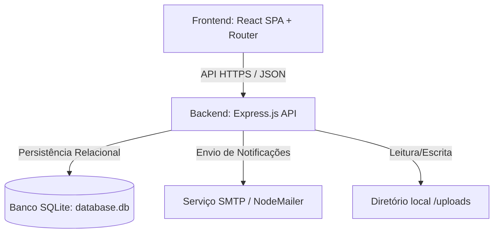
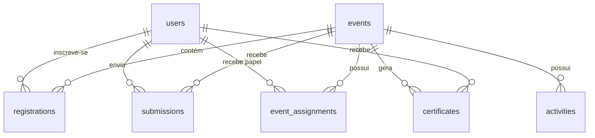

# 🎓 G-TERCOA Eventos - Plataforma de Gestão de Eventos Acadêmicos


O **G-TERCOA Eventos** é uma plataforma integrada multi-tenant inspirada na arquitetura do Even3, desenvolvida sob medida para o **Grupo de Estudo e Pesquisa em Educação Matemática e Pedagogia (G-TERCOA)**. A plataforma gerencia de ponta a ponta o ciclo de vida de eventos acadêmicos de diversos formatos (como escolas de verão, workshops, diálogos e ciclos de lives), cobrindo inscrição de participantes, submissões científicas com avaliação às cegas, programação de atividades, credenciamento via QR Code (quiosque de autoatendimento) e emissão de certificados autenticáveis.

---

## 🏛️ Arquitetura do Sistema

O sistema é dividido em uma estrutura clássica cliente-servidor de alta performance e baixo acoplamento:



### 💻 Frontend (Interface do Usuário)
* **Framework**: React 19 (com Vite para build ultrarrápido).
* **Navegação**: Roteamento dinâmico HTML5 limpo (`react-router-dom`) com URLs amigáveis para cada evento (ex: `/evento/escola-verao-2026`).
* **Design System**: Estética premium baseada em *Glassmorphism* com paleta harmônica azul-escura/accent-gold, tipografia limpa, micro-animações nativas de transição e responsividade total.
* **Componentização**: Modularizada com ícones da biblioteca `lucide-react`.

### ⚙️ Backend (Servidor de Aplicação)
* **Plataforma**: Node.js com Express.js.
* **Segurança**: Autenticação stateless via JSON Web Tokens (JWT) e criptografia de senhas usando `bcryptjs`.
* **Uploads**: Multer para armazenamento seguro de artigos científicos e banners de eventos.
* **E-mails**: Integração com NodeMailer para envio de confirmações de inscrições por e-mail com fallback simulado em arquivos locais em `/sent_emails` para facilidade em desenvolvimento.
* **PDFs**: Geração dinâmica de certificados e comprovantes usando `pdfkit`.

### 🗄️ Banco de Dados (SQLite Relacional)
Banco de dados leve e eficiente encapsulado em `backend/database.db`. Possui as seguintes entidades relacionais estruturadas:



---

## 🔑 Funcionalidades de Destaque

### 1. 👥 Gestão de Comissão & Coordenação de Eixos
O administrador geral pode designar membros da comissão científica para dois papéis específicos em cada evento:
* **Avaliadores Gerais**: Pareceristas técnicos cadastrados para avaliar trabalhos específicos alocados a eles.
* **Coordenadores de Eixo**: Cada coordenador assume a responsabilidade por coordenar as submissões de um determinado **Eixo Temático** do evento.
  * O Coordenador de Eixo tem autonomia para visualizar artigos submetidos em seu eixo, selecionar e alocar avaliadores a cada trabalho e emitir o parecer final (Decisão Oficial).

### 2. 🙈 Avaliação às Cegas Absoluta (Double-Blind Review)
Para assegurar a integridade científica e cumprir rigorosamente as normas éticas:
* **Sigilo de Autoria**: Ao analisar ou avaliar um artigo na Dashboard, os avaliadores e coordenadores **não têm acesso** aos nomes dos autores, filiação institucional ou metadados de autoria. Esses dados são removidos nas consultas do banco de dados (Query Projection) no backend antes de serem trafegados para a API.
* **Sigilo de Avaliação**: O participante recebe o parecer (Aceito, Aceito com Ressalvas ou Rejeitado) e os comentários do revisor, mas a identidade do parecerista e do coordenador de eixo que avaliaram seu trabalho é mantida sob absoluto anonimato.

### 3. 🎫 Quiosque de Autoatendimento e Check-in com QR Code
* **Credencial Digital**: Cada inscrito tem acesso a um cartão de credenciamento virtual (estilo carteira móvel) contendo um QR Code único gerado dinamicamente com seu ID de inscrição.
* **Modo Quiosque (Admin)**: Tela dedicada para o credenciamento rápido de eventos. O recepcionista do evento pode escanear o QR Code impresso/digital ou digitar o CPF do participante para realizar o check-in. O sistema emite alertas visuais e sonoros diferenciados (*beeps* de sucesso/erro) facilitando a logística em tempo real.

### 4. 🎨 Customização e Emissão Dinâmica de Certificados
* **Event Builder**: Permite configurar eixos temáticos, categorias de preço para inscrição, links de streaming externos para lives e regras de formatação (com destaque para a conformidade com as normas ABNT).
* **Editor Gráfico de Certificados**: O administrador pode definir a cor da borda do certificado, os nomes e cargos das assinaturas que constarão no documento e customizar o texto-padrão (template) para 4 modalidades distintas:
  1. *Participação* (gerado em lote para todos os presentes com check-in ativo).
  2. *Apresentação de Trabalho* (com inserção dinâmica do título do artigo aprovado).
  3. *Comissão Organizadora* (para os administradores e staff).
  4. *Convidado Especial / Palestrante* (para conferencistas).
* **Validador de Certificados**: Tela pública (/verify) que permite a qualquer instituição digitar o código verificador do certificado e consultar os dados autênticos do portador direto da base relacional do G-TERCOA.

---

## 🛠️ Configuração e Variáveis de Ambiente

No diretório `backend`, crie um arquivo `.env` para gerenciar as configurações do servidor e do serviço de e-mail. Exemplo:

```env
# Configurações do Servidor
PORT=5000
JWT_SECRET=g_tercoa_secret_key_12345

# Serviço SMTP (Preencher para envio real de e-mails em produção)
SMTP_HOST=smtp.exemplo.com
SMTP_PORT=587
SMTP_USER=no-reply@gtercoa.org
SMTP_PASS=SenhaSeguraDoEmail
SMTP_SECURE=false
EMAIL_FROM="G-TERCOA Eventos <no-reply@gtercoa.org>"
```

*Nota: Se os campos de SMTP forem deixados vazios, o backend opera em modo sandbox, salvando todos os e-mails gerados em arquivos JSON legíveis na pasta `/backend/sent_emails/`.*

---

## 🚀 Como Executar o Projeto Localmente

### Pré-requisitos
* Node.js (versão 18 ou superior) instalado.

### Passo 1: Configurar e Executar o Backend
1. Abra um terminal na pasta `backend`.
2. Instale as dependências necessárias:
   ```bash
   npm install
   ```
3. Inicialize o servidor de desenvolvimento:
   ```bash
   node index.js
   ```
   *O backend criará o arquivo `database.db` e aplicará automaticamente as tabelas e migrations pendentes na primeira execução.*

### Passo 2: Configurar e Executar o Frontend
1. Abra outro terminal na pasta `frontend`.
2. Instale as dependências:
   ```bash
   npm install
   ```
3. Inicialize o servidor Vite:
   ```bash
   npm run dev
   ```
   *Por padrão, a aplicação estará disponível no endereço: `http://localhost:5173/`.*

### Passo 3: Executar a Suíte de Testes do Banco
O backend inclui um script automatizado de integração relacional para garantir a consistência das tabelas e chaves estrangeiras SQLite. Para executá-lo:
```bash
node test_db.js
```

---

## 👤 Credenciais de Teste / Acesso

A plataforma inicializa automaticamente uma conta de Administrador Geral por padrão na primeira carga do banco de dados:

* **Administrador Geral**:
  * **E-mail**: `admin@gtercoa.org`
  * **Senha**: `admin`

Para testar as outras funções (Avaliador, Coordenador de Eixo e Participante), basta criar novas contas na tela de cadastro da aplicação ou utilizar as APIs expostas.

---

## 📄 Licença e Uso

Este software pertence ao **G-TERCOA** e é restrito a fins acadêmicos e institucionais. Qualquer distribuição comercial ou cópia de código sem autorização expressa é terminantemente proibida.
